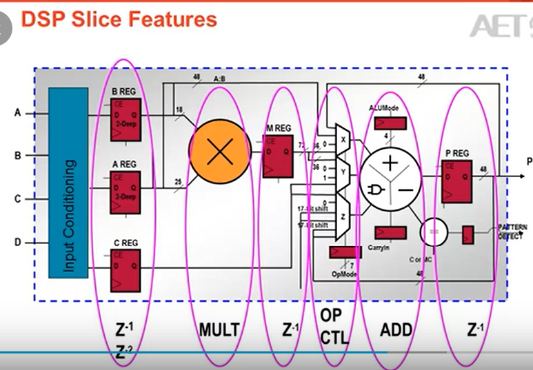
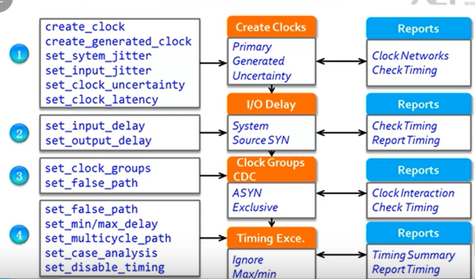
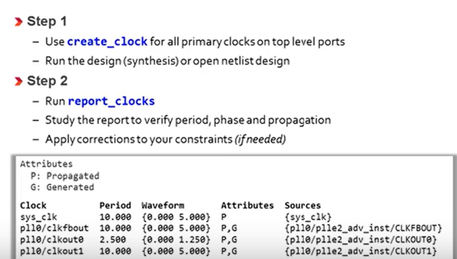
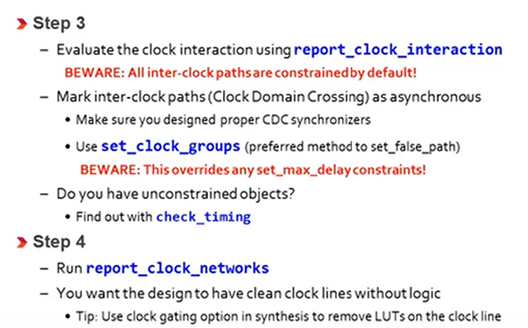
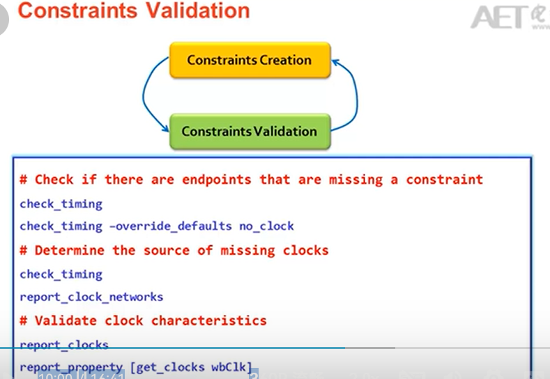
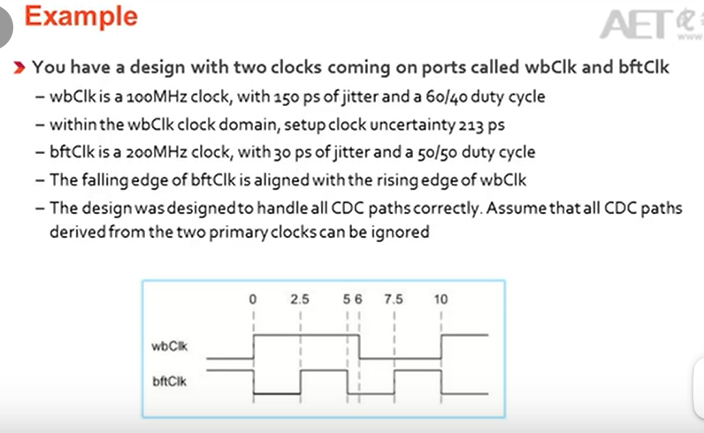
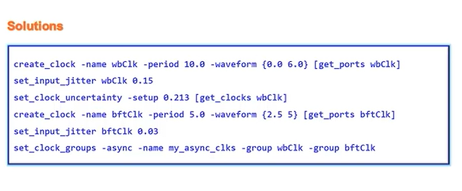
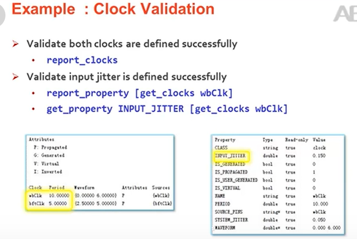

# UltraFast design flow
1. Checklist can be downloaded to help you perform project management


# Clocking
## Use MMCM or PLL properly
1. Do not leave any inputs floating
2. RST connected to user logic
3. LOCKED output should be used in the implementation of reset
4. Consider whether the phase is in phase.

## Safe clock startup and sequencing
1. Safe clock startup can be used to generate slower clock from PLL.
2. Sequencing can be used
3. Clock uncertainty in STA.

# RTL Coding for FPGA
1. Use of debug logic. cam use `ifdef in design phase, to remove this debug wire out.


## control signals and control sets
1. If lots of control sets exist, wasting resources
2. Hope that FSM should be as simple as possible.
3. This reports the control sets within fpga
```
    report_control_sets -verbose
```

## When and where to reset a reset
1. It is not necessary to code a global reset for the sole purpose of initializing the device
2. No reset brings much greater flexibility in selecing the FPGA resources
3. Without resets, we can map the design on to FPGA easier.
4. Use active High control signals
5. We should prevent asynchronously reset, synchronously reset is preferred.

## Know what you have inferred.
1. Carry chain + one LUT per 2-bit  addition
2. Mult use DSP blocks
3. Shift registers or delay lines mapped to shift registers LUTs or SRLs.
4. For conditional code resulting in standard mux components

## RAM usage
1. Use dedicated blocks or distributed rams = dedicated block RAM?
2. Using output pipelined register?

## When use RAM?
1. If depth more than 256, use RAM.

## Additional Output register is prefered for memory RAM
1. So the total read latency is 3 for a block ram


## Select the proper block RAM write mode
1. Consider functionality first
- if see prior value in block ram during write, select READ_FIRST
- WRITE_FIRST
- In common case. we wish to use NO_CHANGE MODE in its behaviour

## DSP slice utilization
1. We must try to fully utilize the DSP slice block by cutting the design into a 3-stage pipeline.


## Coding for proper DSP and ARU inference
1. Avoid asynchronous resets.
2. Code using signed values in HDL src to best match the resource capabilities.
3. For other DSP blocks look for document of your FPGA.

## Coding shift registers and delay lines
1. SRL16 and SRL32
2. One should not code reset for it.


## Verilog restting signals
1. this is being used only in FPGA.
```verilog
reg reg1 = 1'b0;
reg reg2 = 1'b0;
reg reg3 = 4'b1011;
```

# Constraint and attirbutes
1. Embed directives that impact functionality as an attribute in HDL src.


# Clock

1. Beware of the reports in every step to ensure it works.
2. Use create_clock for primary clock.
3. report_clocks
4. Study report to verify period.
5. Use Primary CLOCK!!! on fpga!!! No matter what

6. The clock setting steps are as follows.




7. Jitters and uncertainty shall be set.

8. Clock report analysis


9. Example of setting a clock.


